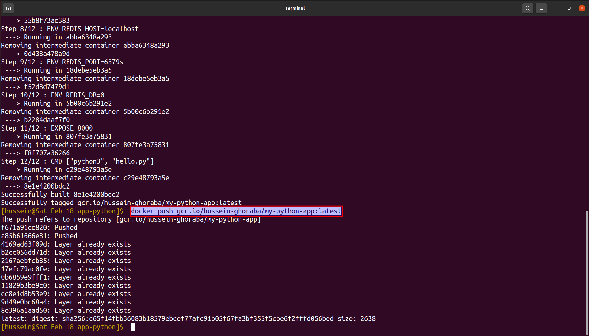
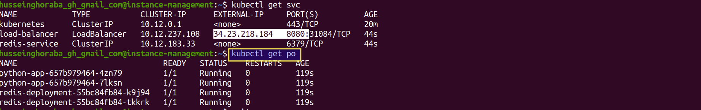
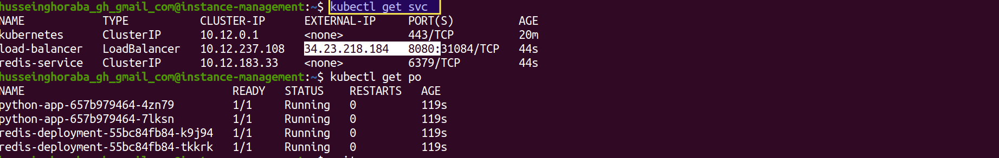

# $${\color{blue}GCP-Project}$$	
## A brief about the project:
**Project of `dockerization` a python application and `deploy` it into a `private cluster` "The Project include the setup and creation of the `infrastructure` till running the application in the cluster through a private VM"**

###                ______________________________________________________________________________________________


> ## Follow the next steps to run this project:

## Pre-Requests:

**Follow the steps inside each link from the following to finish the pre-requests:**

> 1- GCP-Project 
```
https://cloud.google.com/resource-manager/docs/creating-managing-projects 
```
> 2- gcloud sdk on your local machine 
```
https://cloud.google.com/sdk/docs/install
```
> 3- Install Docker in your local machine
```
https://docs.docker.com/engine/install
```
> 5- Configure Docker on your local machine with cloud SDK 
```
https://cloud.google.com/container-registry/docs/advanced-authentication
```
> 6- Terraform setup on you local machine
```
https://developer.hashicorp.com/terraform/tutorials/aws-get-started/install-cli 
```
> 7- install git on your local machine
```
https://github.com/git-guides/install-git
```
### --------------------------------------------------
### 1- Creating the infrastructure of the project on GCP:

> 1- In a new directory use the next command in the bash shell to download the files from this repo
```
git clone git@github.com:HusseinGhoarba/GCP-Project.git
```
> 2- Open file `terraform-files` and edit on files `terraform.tfvars` values of : 
	
	2-1- `user-project-id` --> add  `<your-project-id>`
	
	2-2- `user-region`     --> add  `<your-prefered-region>`
	
	2-3- `user-zone`       --> add  `<your-prefered-zone>`
	
     Open file `user-data.sh` and edit the value of the zone inside the line `no.25` with your `<your-prefered-zone>`

> 3- run the following commands as follows:
```
terraform init
```
screenshot from the command:


```
terraform plan
```
screenshot from the command:


```
terraform apply
```
screenshot from the command:


### --------------------------------------------------
### 2- Building Docker-Image and Push it:

> 1- change your directory to the app-python and run the following command in your terminal after changing `<your-project-id>` with yours:
```
docker build . -t gcr.io/<your-project-id>/my-python-app
```
screenshot from the command:


> 2- Push the created image by the following command to your container registry of your google cloud project after changing `<your-project-id>` with yours:
```
docker push gcr.io/<your-project-id>/my-python-app:latest
```
screenshot from the command:



### --------------------------------------------------
### 3- Deploy the image into the cluster using the private vm:
**"General Hint: make sure to replace the `<your-project-id>` with yours and replace the `<your-preferred-zone>` with yours"**
> 1- Connect to the private-instance which is in the management-subent: 
```
gcloud compute ssh --project=<your-project-id>  --zone=<your-added-preferred-zone> instance-management
```
screenshot from the command:


> 2- Download the files of the repo. using git:
```
git clone https://github.com/HusseinGhoarba/GCP-Project.git
```
screenshot from the command:


> 3- connect to the cluster:
```
gcloud container clusters get-credentials python-cluster --zone <your-added-preferred-zone> --project <your-project-id>
```
screenshot from the command:


> 4- change your current directory to GCP-Project:
```
cd GCP-Project/
```
> 5- deploy the resources into the python-cluster:
```
kubectl apply -f deployment/
```
screenshot from the command:


> 6- make sure that all pods are running and get services:
```
kubectl get po
```
screenshot from the command:



```
kubectl get svc
```
screenshot from the command:



> 7- from the previous step get the external of the IP as the next photo and the port and go to any web-browser and write `<external-ip>:<port>`:
screenshot from the command:


> 8- press on reload and check the counter 


### --------------------------------------------------
### Finally: 
**I want to THANK YOU & If there is any problem don't hesitate to send to me**
### --------------------------------------------------
### Project Contributers:
||
|:-----------------:|
|[Hussein Ghoraba](https://github.com/HusseinGhoarba)|

